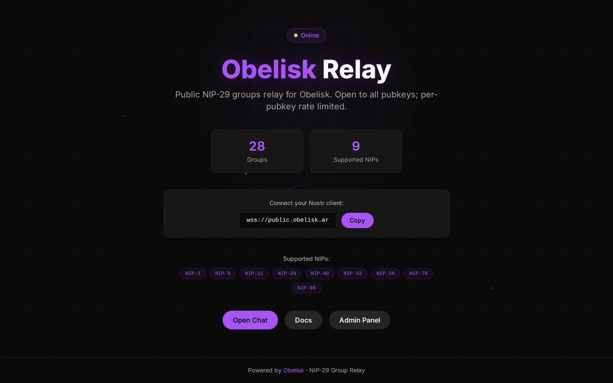

# Obelisk Relay

NIP-29 Nostr Groups Relay for the Obelisk ecosystem. Role-based, moderated, with a built-in admin console.

Live instance: `wss://public.obelisk.ar`
Forked from [verse-pbc/groups_relay](https://github.com/verse-pbc/groups_relay).



<p>
  <a href="https://github.com/obelisk-app/obelisk-relay/stargazers"></a>
  <a href="LICENSE"></a>
</p>

## What it does

A NIP-29 relay manages **group chats at the relay level** — unlike a vanilla Nostr relay that only stores and forwards events, this one:

- 🔐 **Layered admission** — a manual allowlist, everyone your reference accounts follow, or web-of-trust distance in the follow graph. NIP-42 authenticated, and a blacklist that overrides all of it.
- 👥 **Role-based permissions** — admin / mod / member, enforced server-side
- 🔒 **Private groups** — content visible only to members
- 🎫 **Invite codes** — expiring, usage-capped, minimum length enforced
- 🚩 **Moderation queue** — NIP-56 reports, grouped by what was reported, with the reported message kept even if it is later deleted
- 🌐 **Built-in admin console** — everything below is a screen in it, no SSH required
- ⚡ **Cashu wallet** — NIP-60/61 micropayments

## The admin console

Sign in with your Nostr identity — browser extension, remote signer, or a pasted key.


**Access** — every rule that decides who can connect, and who each one lets in. Rate limits are per-pubkey, per-connection and relay-wide, and the budget falls off with distance in the follow graph.


**Groups** — browse groups, metadata, members and stored events.


**Reports** — NIP-56 moderation reports, one row per reported thing however many people reported it. Only relay admins can read these. The reported message is shown inline, and is captured when the report arrives so deleting it is not a way out.


**Storage** — what the relay has stored, what it is spending disk on, and whether anything is being pruned.


## The Obelisk family

| Repo | What |
|------|------|
| [obelisk-app/obelisk](https://github.com/obelisk-app/obelisk) | The chat app (relay-only) |
| [**obelisk-app/obelisk-relay**](https://github.com/obelisk-app/obelisk-relay) | This repo — the NIP-29 relay |
| [obelisk-app/obelisk-sfu](https://github.com/obelisk-app/obelisk-sfu) | mediasoup SFU for voice |
| [obelisk-app/obelisk-bots](https://github.com/obelisk-app/obelisk-bots) | Nostr bots toolkit |
| [obelisk-app/obelisk-classic](https://github.com/obelisk-app/obelisk-classic) | The original centralized stack |

## How it works

Installation is split in two so each step has exactly one job:

| Step | Script | What it does | Requires a domain? |
|------|--------|-------------|---------------------|
| 1. Install | `./setup.sh` | Builds and runs the relay on `http://localhost:8080`. Generates config, whitelists your admin npub, starts Docker if needed. | **No** |
| 2. Expose  | `./expose.sh` | Publishes the local relay to `wss://your.domain` through a Cloudflare Tunnel sidecar that auto-restarts on reboot. | Yes (Cloudflare) |

You can stop at step 1 and use the relay locally. Run step 2 whenever you're ready to go public — and re-run either script anytime to update settings.

## Prerequisites

**For `./setup.sh` (local install):**

1. **A machine that stays on** — Linux VPS, a Mac, or any always-on box. 1 vCPU / 1 GB RAM is plenty for personal use.
2. **Docker + Docker Compose** — Docker Desktop on macOS/Windows; `apt install docker.io docker-compose-plugin` on Debian/Ubuntu. The wizard will start the daemon for you if it's installed but not running.
3. **~3 GB free disk space** — the first build pulls a Rust toolchain image and compiles the relay + frontend. After the build, the running relay uses <100 MB; the LMDB database grows with event volume.

**For `./expose.sh` (publish to the internet):**

4. **A domain on Cloudflare** (free). Either register one through Cloudflare, or point your existing domain's nameservers to the ones Cloudflare gives you when you "Add a site". Wait for status to read "Active".
5. **A Cloudflare Tunnel token** — created in the Zero Trust dashboard (Networks → Tunnels → Create a tunnel). The `expose.sh` wizard walks you through exactly which buttons to click; it takes about 5 minutes.

> Cloudflare Tunnel is recommended because it works behind NAT, on residential ISPs, on $5 VPSes — anywhere with outbound internet. No port forwarding, no static IP, no Caddy/nginx, no Let's Encrypt. If you'd rather use Caddy or nginx with a public IP, point a reverse proxy at `localhost:8080` and update `relay_url` in `config/settings.local.yml`.

## Quick start

```bash
git clone https://github.com/obelisk-app/obelisk-relay.git
cd obelisk-relay

# Step 1 — install locally (always)
./setup.sh

# Step 2 — publish to the internet (when you're ready)
./expose.sh
```

`setup.sh`:
1. Verifies Docker is installed and starts the daemon if needed
2. Checks port 8080 and disk space
3. Asks for your admin npub (npub or hex)
4. Lets you add more whitelisted pubkeys
5. Backs up any existing config, writes a fresh one, and brings up `groups_relay`

By default `setup.sh` pulls a prebuilt multi-arch image from `ghcr.io/obelisk-app/obelisk-relay:latest` (first install ≈ 30 seconds). Pass `./setup.sh --build` if you're hacking on the relay code and want to compile from source instead.

> **`:latest` is currently behind.** The newest builds are published as dated
> tags (`v2026.09.19-reports-4-arm64` at the time of writing) and `:latest` has
> not been moved to them, because those builds are arm64-only and `:latest` is
> multi-arch — repointing it would break every amd64 install with
> `no matching manifest for linux/amd64`. Until an amd64 leg is built in CI and
> the two are joined with `docker buildx imagetools create`, pin the dated tag
> explicitly if you want the current relay:
>
> ```bash
> RELAY_IMAGE_TAG=v2026.09.19-reports-4-arm64 ./setup.sh
> ```

`expose.sh`:
1. Confirms the relay is healthy locally
2. Walks you through creating a Cloudflare Tunnel in the dashboard
3. Saves your tunnel token to `.cloudflared.env` (gitignored)
4. Writes `compose.cloudflared.yml` — a sidecar that runs `cloudflared` and connects to your tunnel
5. Updates the relay's advertised `relay_url` and brings the tunnel up
6. On reboot, both containers auto-restart together

## Management

```bash
# Local-only (just the relay)
docker compose ps
docker compose logs -f
docker compose restart
docker compose down

# After ./expose.sh (relay + tunnel)
alias dco='docker compose -f compose.yml -f compose.cloudflared.yml'
dco ps
dco logs -f cloudflared
dco restart
dco down

# Stop publishing but keep the relay running locally
dco stop cloudflared
```

## Release and deployment

Prebuilt relay images are published to GHCR:

```text
ghcr.io/obelisk-app/obelisk-relay
```

Use [docs/release-deploy-ghcr.md](docs/release-deploy-ghcr.md) for the
multi-arch Buildx release flow, arm64 repair flow, pinned deploy commands,
verification, rollback, and private-file rules.

## Configuration

Edit `config/settings.local.yml`:

```yaml
relay:
  relay_url: "wss://relay.yourdomain.com"
  whitelisted_pubkeys:
    - "hex_pubkey_here"
```

Restart after changes: `docker compose restart` (or `dco restart` if the tunnel is up).

## Supported NIPs

NIP-29 (relay-based groups) · NIP-09 (deletion) · NIP-40 (expiration) · NIP-42 (auth) · configurable NIP-50 (indexed search) · NIP-70 (protected events)

Set `relay.enable_indexed_search: false` to reject NIP-50 `search` filters and stop advertising NIP-50.

## Architecture

```
Internet → Cloudflare edge → cloudflared sidecar → relay container (:8080)
                            ├── Axum HTTP server
                            │   ├── WebSocket → Nostr protocol
                            │   ├── /health, /metrics
                            │   └── / (Preact frontend)
                            ├── GroupsRelayProcessor (NIP-29 logic)
                            ├── ValidationMiddleware (event validation)
                            └── nostr-lmdb (LMDB database)
```

See [CLAUDE.md](CLAUDE.md) for the full architecture, event-processing flow, and supported event kinds.

## Stack

Rust (Tokio + Axum) · `relay_builder` + `websocket_builder` (verse-pbc) · `nostr-sdk` · `nostr-lmdb` · Preact + TypeScript frontend · Docker

## Roadmap

See [ROADMAP.md](ROADMAP.md) — the next milestone is a Nostr-authenticated admin panel for content moderation.

## Legal

AGPL-3.0 — see [LICENSE](LICENSE). Provided **as-is, without warranty of any kind**.

This is a fork of [verse-pbc/groups_relay](https://github.com/verse-pbc/groups_relay); the copyleft
is inherited, not chosen.

Running this software makes **you** the operator of your relay, responsible for what it stores and
serves. Set your own NIP-11 `contact` before exposing it publicly — see [ABUSE.md](ABUSE.md).

- **Abuse on an Obelisk-operated relay:** abuse@obelisk.ar
- **Security vulnerabilities:** [SECURITY.md](SECURITY.md) — security@obelisk.ar
