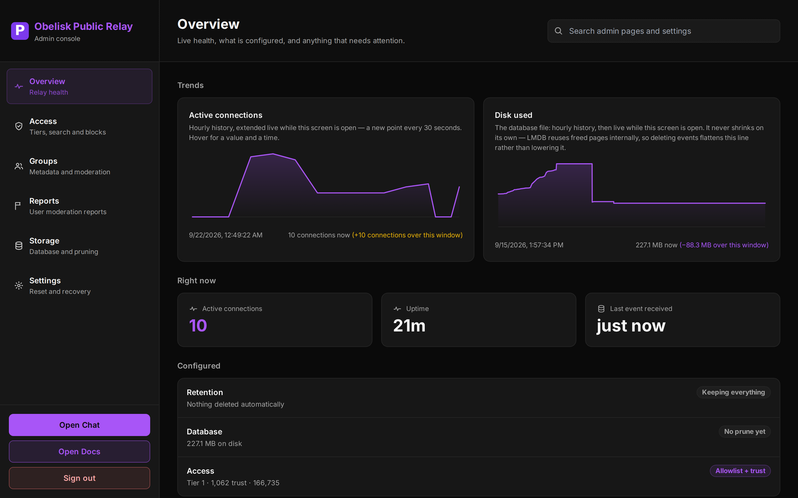
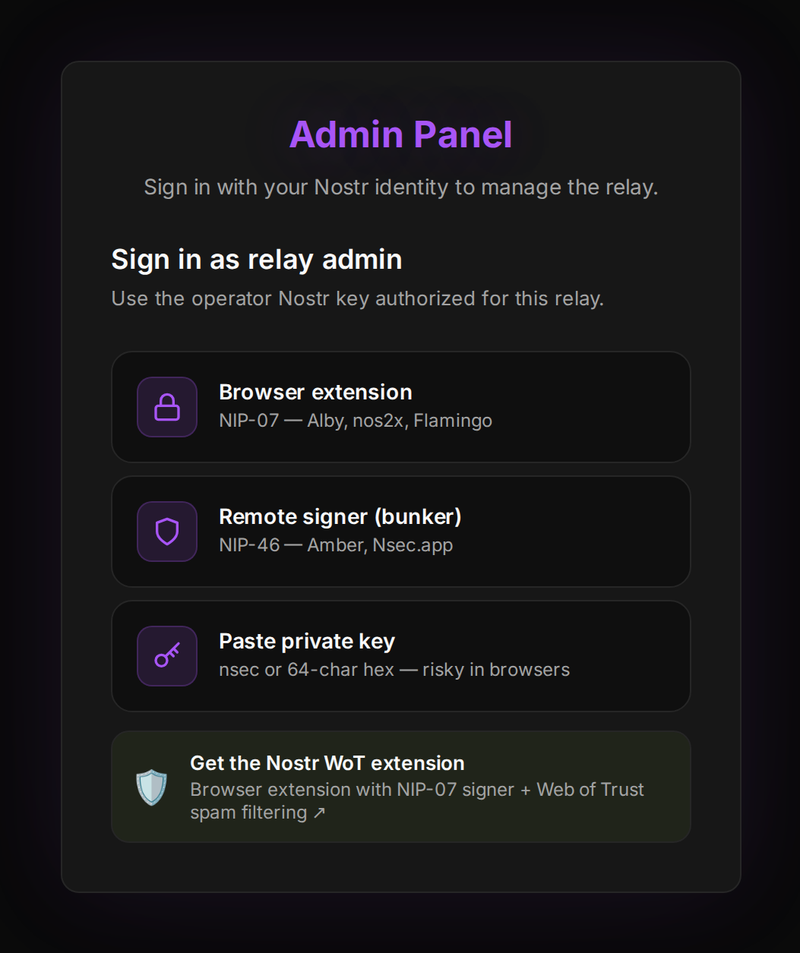
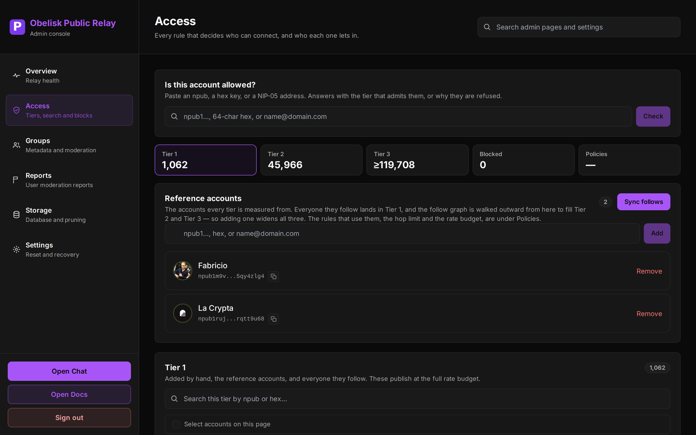
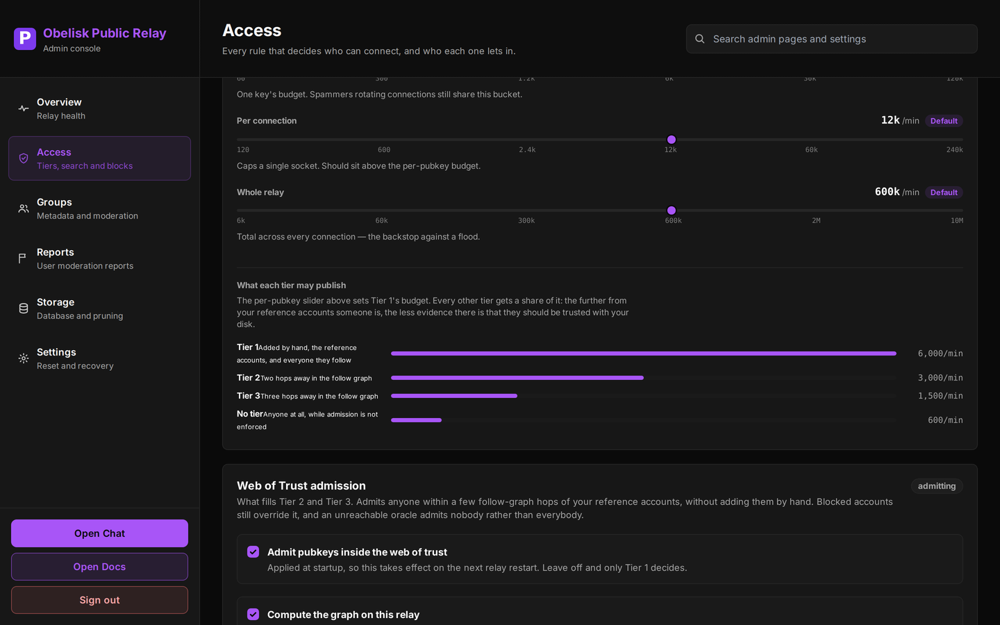
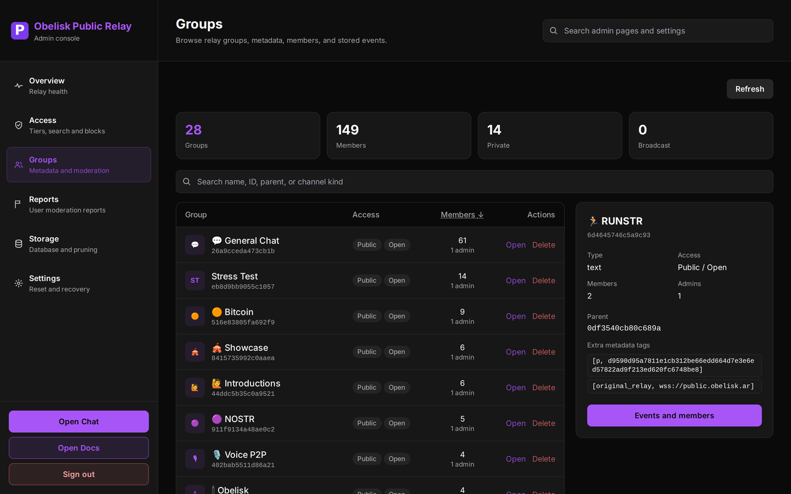
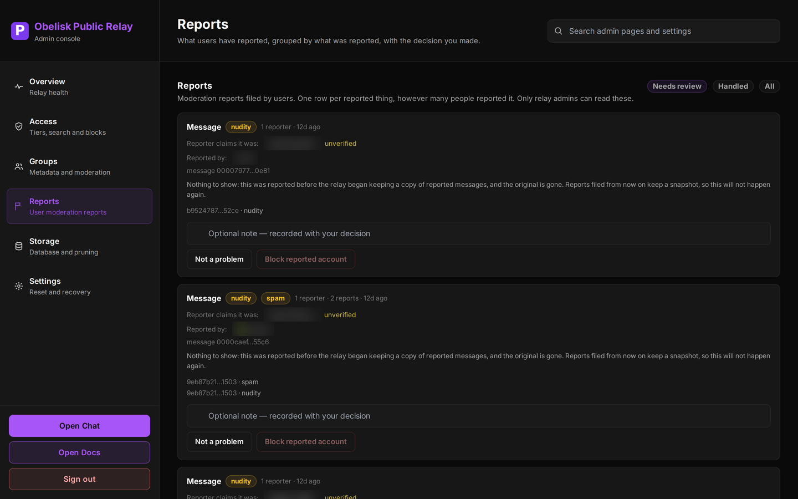
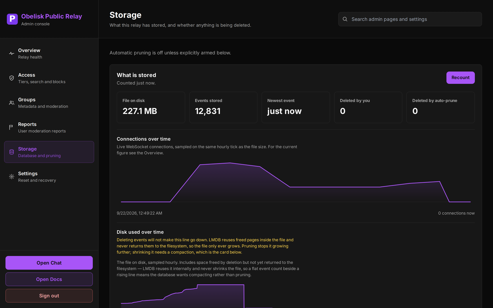

<div align="center">

# Obelisk Relay

**Group chat that lives in the relay, not in an app.**

A NIP-29 Nostr relay with server-side membership, roles, private groups,
web-of-trust admission, and a moderation console you can actually work from.

[](https://github.com/obelisk-app/obelisk-relay/stargazers)
[](LICENSE)
[](#architecture)

Live instance **`wss://public.obelisk.ar`** · Chat client **[obelisk.ar](https://obelisk.ar)**

[Why](#why-a-relay-level-group) · [Features](#what-you-get) · [The console](#the-console) · [Quick start](#quick-start) · [Docs](#docs)

</div>

<br>



<p align="center"><sub>The console on <code>public.obelisk.ar</code>, 2026-09-22: live connections, disk, and the access mode actually in force.</sub></p>

---

## Why a relay-level group

An ordinary Nostr relay stores events and forwards them. Anyone can write, and
"membership" is whatever each client chooses to believe.

A NIP-29 relay decides instead. Membership, roles and visibility are enforced
where the data lives, so a private group is genuinely private — not merely
hidden by every client that agrees to hide it.

That moves a real burden onto whoever runs it, which is what most of this
project is about: knowing who can connect, seeing what people report, and being
able to act on it without opening an SSH session.

## What you get

| | |
|---|---|
| 🪜 **Admission is a ladder** | Three tiers, decided in that order: added by hand, followed by one of your reference accounts, or close enough in the follow graph. NIP-42 authenticated. A block list overrides all of it. |
| ⚖️ **Budgets by distance** | Each tier publishes on a share of the rate budget — 6,000, 3,000 and 1,500 events a minute by default — because distance from your reference accounts is how much evidence you have. |
| 🔎 **"Is this account allowed?"** | Paste an npub, hex key or NIP-05 address and the console names the tier that admits it, or why it is refused. |
| 👥 **Server-side roles** | Admin / moderator / member, enforced by the relay rather than requested by the client. |
| 🔒 **Private groups** | Content is filtered on read. Non-members get nothing — not a hidden UI. |
| 🎫 **Invites** | Expiring, usage-capped, with a minimum code length so they cannot be guessed. |
| 🚩 **Moderation queue** | NIP-56 reports, one row per reported thing, counted by distinct reporters. The message is captured when the report arrives, so deleting it is not a way out. |
| 🖥️ **Admin console** | Every screen below. No SSH, no YAML editing for day-to-day work. |
| 📦 **Two commands** | `./setup.sh` gives you a relay. `./expose.sh` gives the world a way to reach it. |

## The console

Every screenshot here is the live `public.obelisk.ar` console, captured
2026-09-22.

### Sign in

With a Nostr identity — browser extension, remote signer, or a pasted key if
you insist.

<p align="center"></p>

### Overview — is it healthy, and what is it actually doing

Connections and disk use, extended live while the screen is open, and the
configuration really in force: retention, database size, and the access mode.
That is the screen at the top of this page.

### Access — who gets in, and on whose say-so

Admission is a ladder, not a switch: someone you added by hand, someone your
reference accounts follow, or someone close enough in the follow graph. Paste
any key into **Is this account allowed?** and the console answers with the tier
that admits it — and the tier counts sit right under it.



Rate limits are per-pubkey, per-connection and relay-wide, and the budget falls
off with distance — the further from your references, the less evidence there
is that someone should be trusted with your disk.



### Groups — what is actually on your relay

Every group with its visibility, members and admins, searchable by name, ID or
parent, with the events and members of each one a click away.



### Reports — moderation that survives contact with reality

Ten people reporting one message is one decision, so the queue groups by what
was reported and counts distinct reporters rather than volume. Reports are
readable by relay admins only: on a relay where admission is a social graph, a
public report queue is a retaliation channel.

The reported message is snapshotted when the report lands. Without that, a
reported account deletes their own message and the complaint becomes
unreviewable — deletion as a defence rather than a remedy.



<sub>Reporter names and the accounts they named are blurred here, for the same reason the queue is admin-only.</sub>

### Storage — what you are spending disk on

The file on disk, what it holds, what has been deleted, and whether automatic
pruning is armed — with the disk history that shows why deleting events does
not shrink the file.



## Quick start

```bash
git clone https://github.com/obelisk-app/obelisk-relay.git
cd obelisk-relay

./setup.sh     # 1 — a working relay on localhost:8080
./expose.sh    # 2 — publish it at wss://your.domain  (when you're ready)
```

Installation is split in two so each step has exactly one job.

| Step | Script | What it does | Needs a domain? |
|------|--------|-------------|------------------|
| 1. Install | `./setup.sh` | Builds and runs the relay on `http://localhost:8080`. Generates config, allowlists your admin npub, starts Docker if needed. | **No** |
| 2. Expose | `./expose.sh` | Publishes it at `wss://your.domain` through a Cloudflare Tunnel sidecar that auto-restarts on reboot. | Yes (Cloudflare) |

Stop at step 1 and use it locally. Re-run either script any time to change
settings.

<details>
<summary><b>What each script actually does</b></summary>

<br>

`setup.sh`
1. Verifies Docker is installed and starts the daemon if needed
2. Checks port 8080 and disk space
3. Asks for your admin npub (npub or hex)
4. Lets you add more allowlisted pubkeys
5. Backs up any existing config, writes a fresh one, and brings the relay up

`expose.sh`
1. Confirms the relay is healthy locally
2. Walks you through creating a Cloudflare Tunnel in the dashboard
3. Saves your tunnel token to `.cloudflared.env` (gitignored)
4. Writes `compose.cloudflared.yml` — a sidecar running `cloudflared`
5. Updates the advertised `relay_url` and brings the tunnel up
6. On reboot, both containers restart together

</details>

> [!IMPORTANT]
> **Pin the tag to get the current relay.** `setup.sh` pulls the image pinned
> for `groups_relay` in `compose.yml` (`v2026.09.18-compaction-update-arm64`),
> which is behind what `public.obelisk.ar` runs. The dated builds are
> arm64-only: on amd64 the pull fails and `setup.sh` falls back to building
> from source, which gets you the checked-out code instead. On arm64, pin the
> tag the public relay deploys:
>
> ```bash
> RELAY_IMAGE_TAG=v2026.09.22-console-rework-arm64 ./setup.sh
> ```

## Prerequisites

**For `./setup.sh`:**

1. **A machine that stays on** — Linux VPS, a Mac, any always-on box. 1 vCPU / 1 GB RAM is plenty for personal use.
2. **Docker + Docker Compose** — Docker Desktop on macOS/Windows; `apt install docker.io docker-compose-plugin` on Debian/Ubuntu. The wizard starts the daemon if it is installed but not running.
3. **~3 GB free disk** — the first build pulls a Rust toolchain image and compiles the relay and frontend. After that the relay uses <100 MB; the LMDB database grows with event volume.

**For `./expose.sh`:**

4. **A domain on Cloudflare** (free). Register one there, or point an existing domain's nameservers at Cloudflare and wait for "Active".
5. **A Cloudflare Tunnel token** — Zero Trust → Networks → Tunnels → Create a tunnel. The wizard walks you through which buttons to click; about five minutes.

> Cloudflare Tunnel is the default because it works behind NAT, on residential
> ISPs, on $5 VPSes — anywhere with outbound internet. No port forwarding, no
> static IP, no reverse proxy, no Let's Encrypt. Prefer Caddy or nginx? Point one
> at `localhost:8080` and set `relay_url` in `config/settings.local.yml`.

## Running it

```bash
# Relay only
docker compose ps
docker compose logs -f
docker compose restart

# After ./expose.sh (relay + tunnel)
alias dco='docker compose -f compose.yml -f compose.cloudflared.yml'
dco ps
dco logs -f cloudflared

# Stop publishing, keep the relay running locally
dco stop cloudflared
```

Day-to-day settings — admission, rate limits, connection limits, retention,
identity — are editable from the console's **Access**, **Storage** and
**Settings** screens. For the rest, edit `config/settings.local.yml` and
restart:

```yaml
relay:
  relay_url: "wss://relay.yourdomain.com"
  whitelisted_pubkeys:
    - "hex_pubkey_here"
```

## Supported NIPs

NIP-01 · NIP-09 (deletion) · NIP-11 (relay info) · **NIP-29 (relay-based
groups)** · NIP-40 (expiration) · NIP-42 (auth) · NIP-50 (indexed search,
configurable) · NIP-56 (reporting) · NIP-70 (protected events) · NIP-98 (HTTP
auth)

Set `relay.enable_indexed_search: false` to reject NIP-50 `search` filters and
stop advertising it.

## Architecture

```
Internet → Cloudflare edge → cloudflared sidecar → relay container (:8080)
                            ├── Axum HTTP server
                            │   ├── WebSocket → Nostr protocol
                            │   ├── /health, /metrics
                            │   └── / (Preact frontend + admin console)
                            ├── GroupsRelayProcessor (NIP-29 logic, admission)
                            ├── ValidationMiddleware (size, tags, timestamps)
                            └── nostr-lmdb (LMDB, scoped per subdomain)
```

**Stack:** Rust (Tokio + Axum) · `relay_builder` + `websocket_builder`
(verse-pbc) · `nostr-sdk` · `nostr-lmdb` · Preact + TypeScript · Docker

## Docs

| | |
|---|---|
| [CLAUDE.md](CLAUDE.md) | Architecture, event-processing flow, event kinds |
| [docs/known-issues.md](docs/known-issues.md) | Every sharp edge this deployment has actually hit, and the reasoning behind each fix |
| [docs/release-deploy-ghcr.md](docs/release-deploy-ghcr.md) | Multi-arch release, pinned deploys, rollback |
| [ROADMAP.md](ROADMAP.md) | What is next |
| [ABUSE.md](ABUSE.md) · [SECURITY.md](SECURITY.md) | Operator obligations and disclosure |

`known-issues.md` is worth reading before changing anything. It records real
failures — a silently reverting theme, a database that outgrew RAM, a blacklist
that did not block — and why each was fixed the way it was.

## Legal

AGPL-3.0 — see [LICENSE](LICENSE). Provided **as-is, without warranty of any
kind**.

A fork of [verse-pbc/groups_relay](https://github.com/verse-pbc/groups_relay);
the copyleft is inherited, not chosen.

Running this makes **you** the operator of your relay, responsible for what it
stores and serves. Set your own NIP-11 `contact` before exposing it publicly —
see [ABUSE.md](ABUSE.md).

- **Abuse on an Obelisk-operated relay:** abuse@obelisk.ar
- **Security vulnerabilities:** [SECURITY.md](SECURITY.md) — security@obelisk.ar

---

<div align="center">

**The Obelisk family**

[obelisk](https://github.com/obelisk-app/obelisk) (chat app) ·
[**obelisk-relay**](https://github.com/obelisk-app/obelisk-relay) (this repo) ·
[obelisk-sfu](https://github.com/obelisk-app/obelisk-sfu) (voice) ·
[obelisk-bots](https://github.com/obelisk-app/obelisk-bots) ·
[obelisk-classic](https://github.com/obelisk-app/obelisk-classic)

</div>
